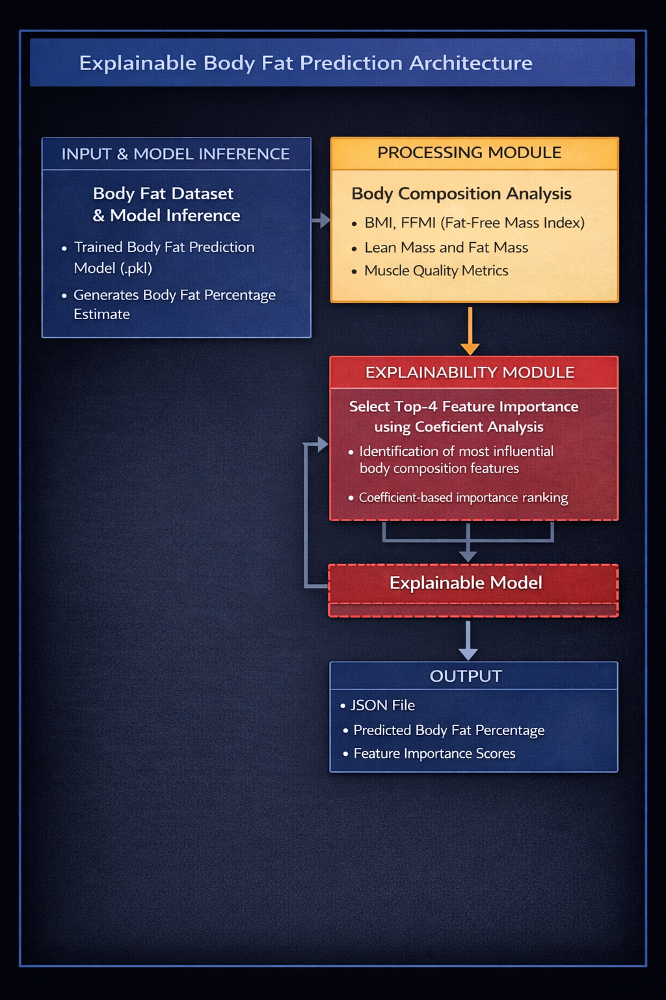
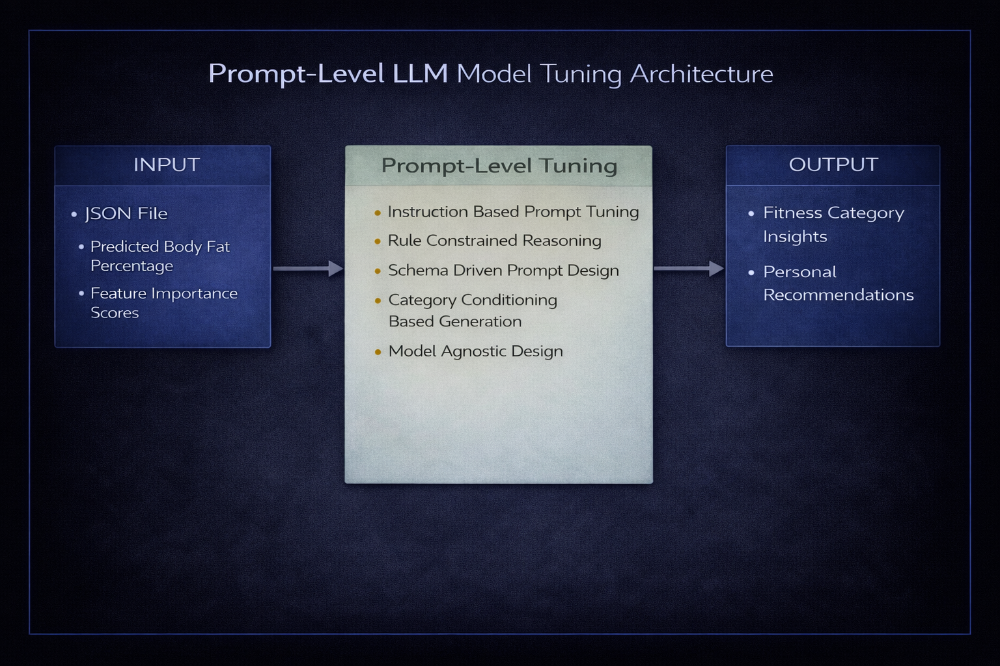

# AI-Powered Body Fat Prediction and Composition Analysis

An AI-driven fitness application that predicts **body fat percentage** using **simple tape-based body measurements**,
 eliminating the need for expensive, time-consuming, and inconvenient traditional body composition methods.
##### **Live Demo:** [Click here to try the app](https://explainable-body-fat-prediction.streamlit.app/)
> The dashboard includes clear documentation of all measurements and parameters, along with a demo video for user convenience.

## 📌 Overview

Traditional body fat measurement techniques are **costly, complex, and difficult to scale**, often requiring specialized equipment and trained professionals.  
This project introduces a **machine learning–based solution** that estimates body fat percentage using **basic anthropometric measurements**, making fitness assessment **accessible, fast, and scalable**.

The system also provides **personalized fitness insights**, guiding users on **what actions to take and what habits to avoid** for better physical maintenance.

## 📊 Dataset

This dataset contains **body composition measurements of 252 adult men**. The goal is to predict **body fat percentage** using **simple anthropometric measurements** such as weight, height, and body circumferences (e.g., abdomen, chest).

### Key Variables
- **BodyFat** – Body fat percentage (target variable)
- **Density** – Body density from underwater weighing (excluded to avoid data leakage)
- **Age, Weight, Height** – Basic physical attributes
- **Neck, Chest, Abdomen2, Hip, Thigh, Knee, Ankle, Biceps, Forearm, Wrist** – Tape-based body measurements (cm)

Body fat percentage is calculated using **Siri’s equation**:

Body Fat % = (495 / Density) − 450

**Link:** https://www.kaggle.com/datasets/fedesoriano/body-fat-prediction-dataset

## ⚙️ How the Application Works ?

Users provide simple body measurements as input, which are processed by a **regression-based machine learning model** to predict body fat percentage. The model also identifies the **most important contributing features** to ensure transparency and explainability.

The prediction results and feature importance are structured into a **JSON format**, which is then passed to a **large language model (LLM)**. The LLM interprets the results and generates **personalized body composition analysis and fitness recommendations**.

Finally, the application displays a clear output including **body fat percentage, body composition insights, and actionable personal recommendations** through an intuitive user interface.
### ⚙️ ML Model Pipeline

- 📊 **Input Data**: Body fat (%) dataset  
- 🧹 **Preprocessing**: Handle missing values, remove duplicates, feature scaling, train–test split  
- 🧠 **Feature Engineering**: Create derived metrics using domain knowledge  
- 🤖 **Model Training**: Regression models with Ridge & Lasso regularization  
- 📈 **Evaluation**: RMSE, R², Adjusted R² to select the **best subset model**  
- 💾 **Output**: Final trained model saved as `model_prediction.pkl` for inference

### 🔍 Explainable Model Pipeline

- 📥 **Input**: Trained model (`model_prediction.pkl`) and body fat prediction output  
- 🧬 **Body Composition Analysis**: BMI, FFMI (Fat-Free Mass Index), lean mass, fat mass, and muscle quality metrics  
- 🧠 **Explainability Module**: Identify top-4 influential features using coefficient-based analysis  
- 📊 **Feature Importance**: Rank key body composition factors driving the prediction  
- 📤 **Output**: JSON response containing predicted body fat percentage and feature importance scores
### 🧩 Prompt-Level LLM Tuning

- 📥 **Input**: JSON output containing predicted body fat percentage and feature importance scores  
- 🧠 **Instruction-Based Prompting**: Guide the LLM using structured, task-specific instructions  
- 📐 **Schema-Driven Prompt Design**: Enforce consistent and reliable output formats  
- 🔒 **Rule-Constrained Reasoning**: Apply domain rules to ensure medically and technically valid responses  
- 🏷️ **Category-Conditioned Generation**: Tailor insights based on body composition categories  
- 🔄 **Model-Agnostic Design**: Works across different LLMs without retraining  
- 📤 **Output**: Enhanced, explainable body fat analysis with domain-aware technical insights

## 🚀 Run Locally (Windows)

1. Download the project as a ZIP file and extract it into a new folder  
2. Open the extracted folder in Visual Studio Code  
3. Create a virtual environment using `python -m venv venv`  
4. Activate the virtual environment using `venv\Scripts\Activate`  
5. Install dependencies using `pip install -r requirements.txt`  
6. Run the application using `streamlit run app.py`    

> **Note:** To enable AI-powered insights, create a `.env` file in the project root and add your API key there. Update the model name and configuration inside `llm_model.py`. The API key is loaded securely at runtime and is not hardcoded.
## 🙏 Acknowledgements

Thanks to **Kaggle** for providing the Body Fat dataset used in this project. We also acknowledge **OpenRouter** for providing access to large language models used for generating personalized fitness insights. Special thanks to the open-source community for the tools and libraries that made this project possible.

## 📚 References

- **World Health Organization (WHO)** – Body composition and health guidelines  
  https://www.who.int/publications/i/item/WHO-NMH-NHD-17.5
- **Prediction of Body Fat Percentage Using Anthropometric Data**  
  https://www.sciencedirect.com/science/article/abs/pii/S1568494617303411 
- **Body Fat Prediction Models in American Adults** 
  https://www.ncbi.nlm.nih.gov/pmc/articles/PMC7156815/ 

